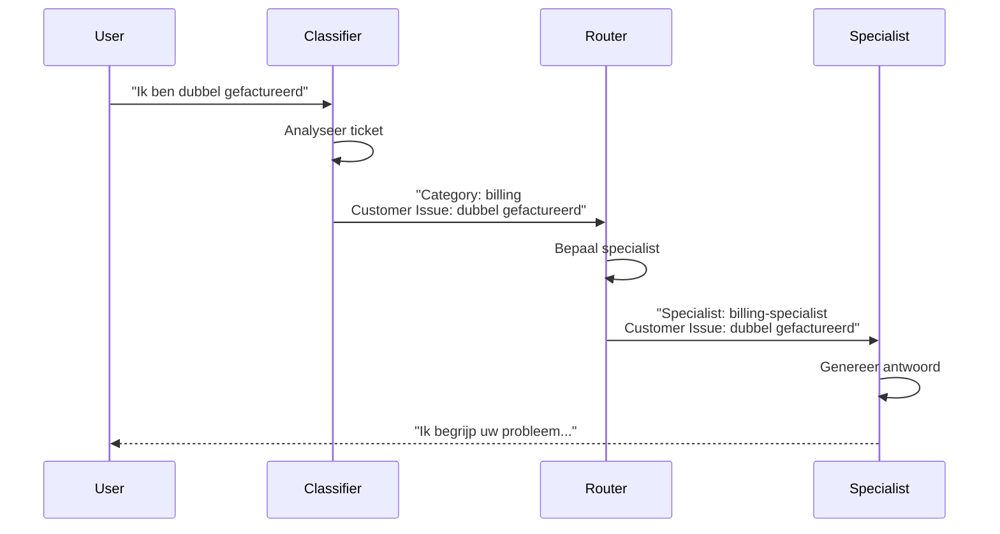
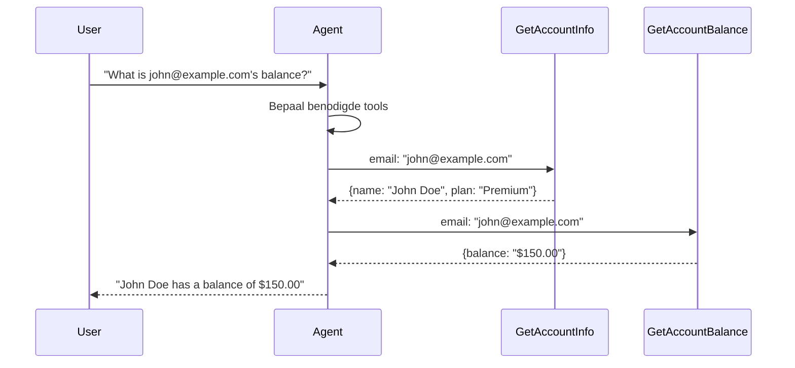
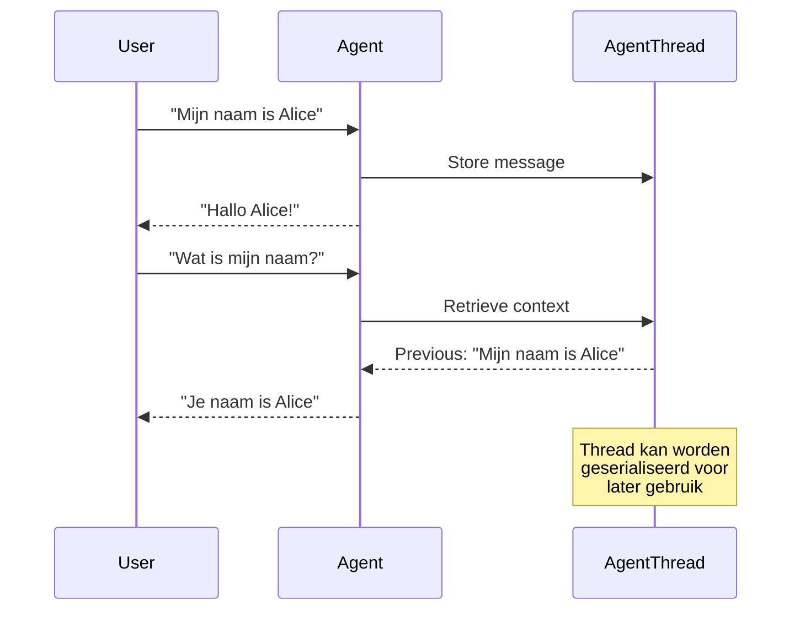
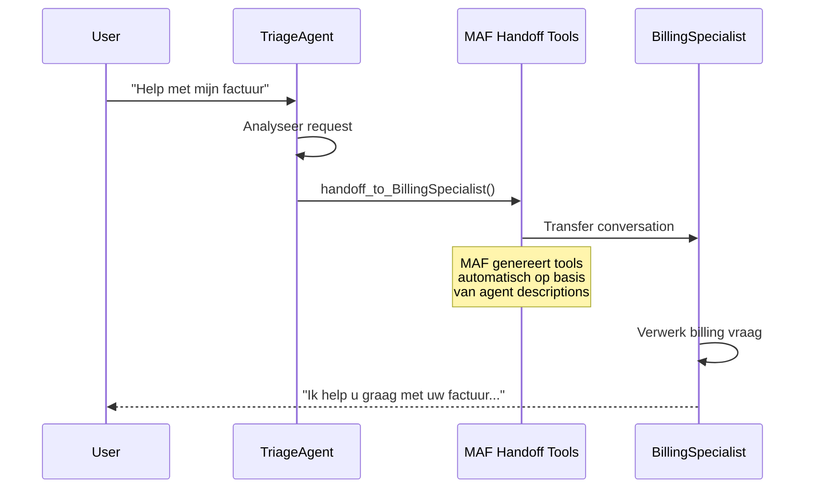
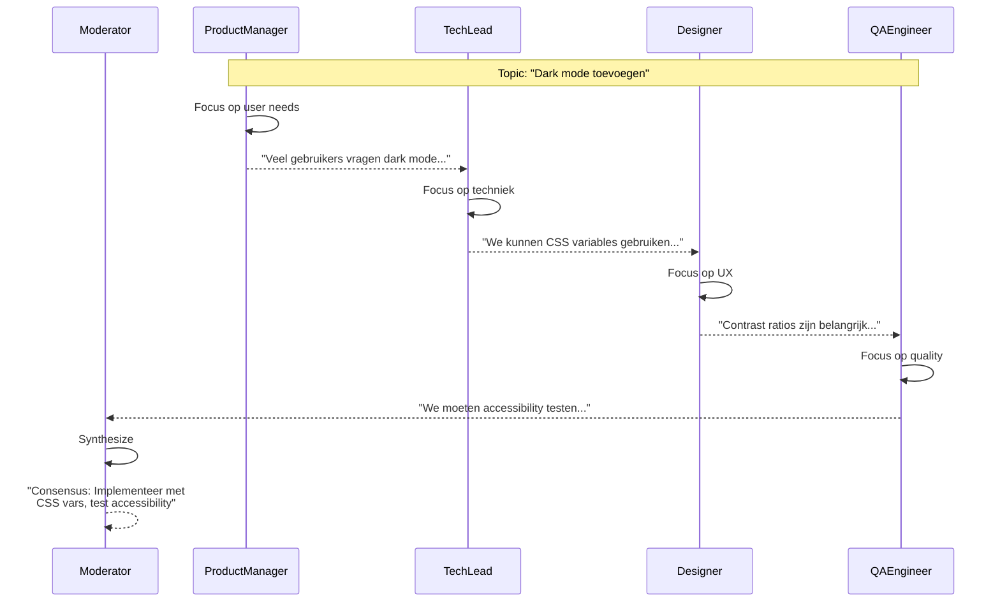

# AbstractMatters.AgentFramework.Poc

Een proof-of-concept applicatie van **AbstractMatters** die **Microsoft Agent Framework (MAF)** demonstreert voor multi-agent workflows.

## Inhoudsopgave

- [Overzicht](#overzicht)
- [MAF Features](#maf-features)
- [Microsoft Agent Framework (MAF)](#microsoft-agent-framework-maf)
- [Architectuur](#architectuur)
- [Technologie Stack](#technologie-stack)
- [Vereisten](#vereisten)
- [Installatie](#installatie)
- [Configuratie](#configuratie)
- [Applicatie Starten](#applicatie-starten)
- [Gebruik](#gebruik)
- [API Documentatie](#api-documentatie)
- [Testen](#testen)
- [Projectstructuur](#projectstructuur)

---

## Overzicht

Deze POC demonstreert een multi-agent workflow systeem voor klantenservice triage met **Microsoft Agent Framework (MAF)**. De applicatie:

- **Classificeert** inkomende supporttickets (billing, technisch, algemeen)
- **Routeert** tickets naar de juiste specialist-agent
- **Verwerkt** tickets met gespecialiseerde AI-agents
- **Trackt** alle experimenten en metrics via MLflow

### Demo Use Case: Klantenservice Triage

```
Klant: "Ik ben twee keer gefactureerd voor mijn abonnement"
    │
    ▼
┌─────────────────┐
│   Classifier    │  → Analyseert ticket → "billing"
│     Agent       │
└────────┬────────┘
         │
         ▼
┌─────────────────┐
│     Router      │  → Bepaalt specialist → "billing-specialist"
│     Agent       │
└────────┬────────┘
         │
         ▼
┌─────────────────┐
│    Billing      │  → Genereert antwoord voor klant
│   Specialist    │
└─────────────────┘
```

---

## MAF Features

Deze POC demonstreert de volgende MAF mogelijkheden:

| Feature | Demo Pagina | MAF Component | Beschrijving |
|---------|-------------|---------------|--------------|
| **Multi-Agent Workflow** | `/workflow-demo` | `WorkflowBuilder`, `AddEdge` | Sequentiële agent pipeline |
| **Function Tools** | `/tools-demo` | `AIFunctionFactory`, `CreateAIAgent` | Agent met callable tools |
| **Conversation Memory** | `/conversation-demo` | `AgentThread`, `Serialize` | Multi-turn gesprekken met geheugen |
| **Agent Handoff** | `/handoff-demo` | `HandoffsWorkflowBuilder`, `WithHandoffs` | Triage agent met automatische handoff tools |
| **Group Chat** | `/group-chat-demo` | `GroupChatWorkflowBuilder`, `RoundRobinGroupChatManager` | Multi-agent discussie met turn management |

---

## Microsoft Agent Framework (MAF)

Deze POC demonstreert het gebruik van **Microsoft Agent Framework (MAF)** - Microsoft's officiële SDK voor het bouwen van multi-agent systemen.

### MAF Packages

```xml
<PackageReference Include="Microsoft.Agents.AI.OpenAI" Version="1.0.0-preview.260108.1" />
<PackageReference Include="Microsoft.Agents.AI.Workflows" Version="1.0.0-preview.260108.1" />
```

### Belangrijke MAF Componenten

| Component | Beschrijving |
|-----------|--------------|
| `IChatClient` | Standaard chat client interface (Microsoft.Extensions.AI) |
| `ChatClientAgent` | MAF agent die een chat client wrapt met instructies |
| `WorkflowBuilder` | Bouwt workflows met agent-to-agent edges |
| `InProcessExecution` | Voert workflows uit met streaming support |
| `AIFunctionFactory` | Creëert callable tools voor agents |
| `CreateAIAgent` | Extension method om agents met tools te maken |
| `AgentThread` | Behoudt gespreksgeschiedenis over meerdere turns |
| `thread.Serialize()` | Serialiseert thread state voor persistentie |
| `agent.DeserializeThread()` | Herstelt thread van geserialiseerde state |

### Hoe MAF Workflows Werken

```csharp
// 1. Maak agents met instructies
var classifier = new ChatClientAgent(chatClient, "Je classificeert tickets...");
var router = new ChatClientAgent(chatClient, "Je routeert naar specialisten...");
var specialist = new ChatClientAgent(chatClient, "Je helpt met billing vragen...");

// 2. Bouw workflow met edges
var workflow = new WorkflowBuilder(classifier)
    .AddEdge(classifier, router)
    .AddEdge(router, specialist)
    .Build();

// 3. Voer uit met streaming
await using var run = await InProcessExecution.StreamAsync(workflow, message);
await run.TrySendMessageAsync(new TurnToken(emitEvents: true));

await foreach (var evt in run.WatchStreamAsync())
{
    if (evt is AgentRunUpdateEvent update)
    {
        Console.WriteLine($"{update.ExecutorId}: {update.Data}");
    }
}
```

### Context Flow: Hoe Agents Samenwerken

In een sequentiële MAF workflow wordt de **output van elke agent de input voor de volgende**:

```
┌─────────────────────────────────────────────────────────────────────┐
│                                                                     │
│  User: "Ik ben dubbel gefactureerd"                                │
│         │                                                           │
│         ▼                                                           │
│  ┌─────────────┐                                                    │
│  │ Classifier  │  Input:  "Ik ben dubbel gefactureerd"             │
│  │             │  Output: "Category: billing"                       │
│  └──────┬──────┘                                                    │
│         │                                                           │
│         ▼                                                           │
│  ┌─────────────┐                                                    │
│  │   Router    │  Input:  "Category: billing"                      │
│  │             │  Output: "Route naar billing-specialist"          │
│  └──────┬──────┘                                                    │
│         │                                                           │
│         ▼                                                           │
│  ┌─────────────┐                                                    │
│  │  Billing    │  Input:  "Route naar billing-specialist"          │
│  │ Specialist  │  Output: "Ik begrijp uw probleem. Laat me..."     │
│  └─────────────┘                                                    │
│                                                                     │
└─────────────────────────────────────────────────────────────────────┘
```

### Waarom Meerdere Agents?

| Voordeel | Uitleg |
|----------|--------|
| **Specialisatie** | Elke agent is geoptimaliseerd voor één taak |
| **Modulariteit** | Agents kunnen onafhankelijk worden verbeterd of vervangen |
| **Traceerbaarheid** | Je ziet precies welke agent wat besloot |
| **Testbaarheid** | Elke agent kan apart worden getest en geëvalueerd |
| **Schaalbaarheid** | Nieuwe specialisten toevoegen zonder bestaande logica te wijzigen |

---

## Wat Kun Je Zien?

Dit project bevat meerdere demo pagina's die MAF mogelijkheden demonstreren:

### 🎯 Workflow Demo (`/workflow-demo`)

**MAF Feature**: `WorkflowBuilder` met `AddEdge`

Demonstreert hoe meerdere AI-agents samenwerken in een sequentiële workflow:
- Drie agents (Classifier → Router → Specialist) die sequentieel samenwerken
- Per agent zie je input, output, token gebruik en executietijd



### 🔧 Tools Demo (`/tools-demo`)

**MAF Feature**: `AIFunctionFactory`, `CreateAIAgent`

Demonstreert agents met callable function tools:
- Agent met 3 tools: `GetAccountInfo`, `GetAccountBalance`, `GetRecentTransactions`
- Test met emails: `john@example.com` of `jane@example.com`



### 💬 Conversation Memory Demo (`/conversation-demo`)

**MAF Feature**: `AgentThread`, `Serialize()`, `DeserializeThread()`

Demonstreert multi-turn gesprekken met geheugen:
- Agent onthoudt context van eerdere berichten
- Thread kan worden geserialiseerd en hervat



### 🤝 Handoff Demo (`/handoff-demo`)

**MAF Feature**: `HandoffsWorkflowBuilder`, `WithHandoffs()`

Demonstreert autonome agent handoffs via MAF's handoff workflow:
- Triage agent kan handoff doen naar: BillingSpecialist, TechnicalSpecialist, AccountSpecialist
- MAF genereert automatisch handoff tools op basis van agent descriptions
- Dit is het authentieke MAF patroon



### 👥 Group Chat Demo (`/group-chat-demo`)

**MAF Feature**: `GroupChatWorkflowBuilder`, `RoundRobinGroupChatManager`

Demonstreert multi-agent samenwerking met MAF's group chat:
- Round-robin speaker selectie via `RoundRobinGroupChatManager`
- Participants: ProductManager, TechLead, Designer, QAEngineer
- Configurable termination condition (max turns)
- Moderator syntheseert consensus aan het einde



---

### 📊 MLflow UI (http://localhost:5000)

Experiment tracking - de workflow demo logt automatisch naar MLflow.

### 🔍 Jaeger UI (http://localhost:16686)

Distributed tracing - visualiseer hoe requests door het systeem stromen.

---

## Architectuur

**Vereenvoudigde Clean Architecture** - MAF verzorgt de orchestratie direct.

```
┌────────────────────────────────────────────────────────────┐
│                         API Laag                           │
│                   WorkflowsController                      │
├────────────────────────────────────────────────────────────┤
│                     Application Laag                       │
│                      IMlflowClient                         │
├────────────────────────────────────────────────────────────┤
│                    Infrastructure Laag                     │
│             MafWorkflowService, MlflowClient               │
│          (Gebruikt MAF WorkflowBuilder direct)             │
├────────────────────────────────────────────────────────────┤
│                       Domain Laag                          │
│             SupportTicket, EvaluationResult                │
└────────────────────────────────────────────────────────────┘
```

### Laag Beschrijvingen

| Laag | Verantwoordelijkheid | Dependencies |
|------|---------------------|--------------|
| **Domain** | Kernentiteiten en business logica | Geen |
| **Application** | Use cases, interfaces | Domain |
| **Infrastructure** | MAF integratie, MLflow client | Application, Domain |
| **API** | HTTP endpoints, request/response handling | Alle lagen |

### Belangrijke Componenten

#### MafWorkflowService
Wrapt MAF WorkflowBuilder voor workflow uitvoering:
- Creëert `ChatClientAgent` instances met instructies
- Bouwt workflows met `WorkflowBuilder.AddEdge()`
- Voert uit met `InProcessExecution.StreamAsync()`
- Verzamelt per-agent outputs en metrics

#### MlflowClient
Communiceert met MLflow voor experiment tracking:
- Creëert experimenten en runs
- Logt parameters en metrics
- Ondersteunt evaluatie workflows

---

## Technologie Stack

### Backend
| Component | Technologie | Versie |
|-----------|-------------|--------|
| Runtime | .NET | 10.0 |
| Web Framework | ASP.NET Core | 10.0 |
| AI/LLM | Microsoft Agent Framework | 1.0.0-preview |
| Functional Programming | LanguageExt | 4.x |
| Experiment Tracking | MLflow | 2.x |
| Tracing | OpenTelemetry + Jaeger | Latest |

### Frontend
| Component | Technologie | Versie |
|-----------|-------------|--------|
| Framework | Angular | 21 |
| UI Library | Angular Material | 21 |
| HTTP Client | Angular HttpClient | 21 |

### Infrastructure
| Component | Technologie |
|-----------|-------------|
| Containerization | Docker Compose |
| LLM Provider | Azure OpenAI |
| Model | GPT-4o |

---

## Vereisten

### Software
- **.NET 10 SDK** - [Download](https://dotnet.microsoft.com/download)
- **Node.js 20+** - Aanbevolen via [nvm](https://github.com/nvm-sh/nvm)
- **Docker & Docker Compose** - [Download](https://docs.docker.com/get-docker/)
- **Angular CLI** - `npm install -g @angular/cli`

### Azure Resources
- **Azure AI Foundry** account met:
  - Een deployed GPT-4 model (bijv. `gpt-4o`)
  - Endpoint URL en API key

---

## Installatie

### 1. Repository Clonen
```bash
git clone <repository-url>
cd abstractmatters-agentframework-poc
```

### 2. .NET Dependencies Installeren
```bash
dotnet restore
```

### 3. Angular Dependencies Installeren
```bash
cd web
npm install
cd ..
```

### 4. Infrastructure Starten (MLflow & Jaeger)
```bash
docker-compose up -d
```

Dit start:
- **MLflow** op http://localhost:5000
- **Jaeger** op http://localhost:16686

---

## Configuratie

### Azure OpenAI Configuratie

Maak het bestand `src/AbstractMatters.AgentFramework.Poc.Api/appsettings.Development.json`:

```json
{
  "Logging": {
    "LogLevel": {
      "Default": "Debug",
      "Microsoft.AspNetCore": "Information"
    }
  },
  "AzureOpenAI": {
    "Endpoint": "https://jouw-resource.cognitiveservices.azure.com/",
    "ApiKey": "jouw-api-key-hier",
    "DeploymentName": "gpt-4o"
  }
}
```

> **Let op**: Dit bestand staat in `.gitignore` en wordt niet gecommit. Deel nooit je API keys!

### MLflow Configuratie

De MLflow URL is geconfigureerd in `appsettings.json`:
```json
{
  "MLflow": {
    "BaseUrl": "http://localhost:5000"
  }
}
```

---

## Applicatie Starten

### Optie 1: Alles Apart Starten

**Terminal 1 - Infrastructure:**
```bash
docker-compose up -d
```

**Terminal 2 - Backend API:**
```bash
cd src/AbstractMatters.AgentFramework.Poc.Api
ASPNETCORE_ENVIRONMENT=Development dotnet run --urls "http://localhost:5139"
```

**Terminal 3 - Angular Frontend:**
```bash
cd web
npm start
```

### Toegangspunten

| Service | URL | Beschrijving |
|---------|-----|--------------|
| Angular Frontend | http://localhost:4200 | Webinterface |
| .NET API | http://localhost:5139 | REST API |
| MLflow UI | http://localhost:5000 | Experiment tracking |
| Jaeger UI | http://localhost:16686 | Distributed tracing |
| OpenAPI/Swagger | http://localhost:5139/openapi/v1.json | API specificatie |

---

## Gebruik

### Via de Webinterface

1. Open http://localhost:4200
2. Navigeer naar **Workflow Demo**
3. Voer een supportvraag in, bijvoorbeeld:
   - "Ik ben dubbel gefactureerd voor mijn abonnement"
   - "Mijn applicatie crasht bij het uploaden van bestanden"
   - "Hoe wijzig ik mijn wachtwoord?"
4. Klik op **Execute Workflow**
5. Bekijk de resultaten van elke agent in de workflow

### Via de API (curl)

```bash
# Multi-agent workflow
curl -X POST http://localhost:5139/api/workflows/execute/demo \
  -H "Content-Type: application/json" \
  -d '{"input": "Ik ben twee keer gefactureerd"}'

# Agent met tools
curl -X POST http://localhost:5139/api/workflows/execute/tools-demo \
  -H "Content-Type: application/json" \
  -d '{"input": "What is the balance for john@example.com?"}'

# Conversation memory
curl -X POST http://localhost:5139/api/workflows/conversation \
  -H "Content-Type: application/json" \
  -d '{"conversationId": "test-123", "message": "Mijn naam is Alice"}'

# Handoff
curl -X POST http://localhost:5139/api/workflows/execute/handoff \
  -H "Content-Type: application/json" \
  -d '{"input": "Help met mijn factuur"}'

# Group chat
curl -X POST http://localhost:5139/api/workflows/execute/group-chat \
  -H "Content-Type: application/json" \
  -d '{"topic": "Moeten we een mobile app bouwen?", "maxTurns": 4}'
```

---

## API Documentatie

### Multi-Agent Workflows

| Methode | Endpoint | Beschrijving |
|---------|----------|--------------|
| POST | `/api/workflows/execute/demo` | Multi-agent triage workflow |
| POST | `/api/workflows/execute/tools-demo` | Agent met function tools |
| POST | `/api/workflows/execute/handoff` | Agent handoff demo |
| POST | `/api/workflows/execute/group-chat` | Multi-agent group chat |

### Conversation Memory

| Methode | Endpoint | Beschrijving |
|---------|----------|--------------|
| POST | `/api/workflows/conversation` | Stuur bericht naar gesprek |
| POST | `/api/workflows/conversation/{id}/serialize` | Serialiseer thread |
| POST | `/api/workflows/conversation/resume` | Hervat gesprek |
| DELETE | `/api/workflows/conversation/{id}` | Wis gesprek |

---

## Testen

### Alle Tests Uitvoeren
```bash
dotnet test
```

### Specifiek Test Project
```bash
# Domain tests
dotnet test tests/AbstractMatters.AgentFramework.Poc.Domain.Tests

# Application tests
dotnet test tests/AbstractMatters.AgentFramework.Poc.Application.Tests

# Infrastructure tests
dotnet test tests/AbstractMatters.AgentFramework.Poc.Infrastructure.Tests

# API tests
dotnet test tests/AbstractMatters.AgentFramework.Poc.Api.Tests
```

### Test Statistieken
| Project | Aantal Tests |
|---------|-------------|
| Domain | 27 |
| Infrastructure | 8 |
| **Totaal** | **35** |

### Test Libraries
- **xUnit** - Test framework
- **NSubstitute** - Mocking
- **AwesomeAssertions** - Fluent assertions (Apache 2.0 licentie)

---

## Projectstructuur

```
abstractmatters-agentframework-poc/
│
├── src/
│   ├── AbstractMatters.AgentFramework.Poc.Domain/           # Kernentiteiten
│   │   ├── SupportTicket.cs
│   │   └── EvaluationResult.cs
│   │
│   ├── AbstractMatters.AgentFramework.Poc.Application/      # Interfaces
│   │   └── Mlflow/
│   │       └── IMlflowClient.cs
│   │
│   ├── AbstractMatters.AgentFramework.Poc.Infrastructure/   # MAF + MLflow integratie
│   │   ├── Agents/
│   │   │   └── MafWorkflowService.cs           # Alle MAF demo's
│   │   └── Mlflow/
│   │       └── MlflowClient.cs
│   │
│   └── AbstractMatters.AgentFramework.Poc.Api/              # Web API
│       ├── Controllers/
│       │   └── WorkflowsController.cs          # Alle endpoints
│       └── Program.cs
│
├── tests/
│   ├── AbstractMatters.AgentFramework.Poc.Domain.Tests/
│   └── AbstractMatters.AgentFramework.Poc.Infrastructure.Tests/
│
├── web/                                         # Angular frontend
│   └── src/app/components/
│       ├── workflow-demo/                      # Multi-agent workflow
│       ├── tools-demo/                         # Function tools
│       ├── conversation-demo/                  # AgentThread memory
│       ├── handoff-demo/                       # Agent handoff
│       └── group-chat-demo/                    # Group collaboration
│
├── docker-compose.yaml                         # MLflow + Jaeger
└── README.md                                   # Deze documentatie (NL)
```

---

## Belangrijke Concepten

### LanguageExt en Fin<T>

Dit project gebruikt **LanguageExt** voor functionele error handling. `Fin<T>` vervangt exceptions voor verwachte fouten:

```csharp
// Retourneer success
return Fin<MlflowExperiment>.Succ(experiment);

// Retourneer fout
return Error.New("Foutmelding");
```

### MAF Agent Configuratie

Agents worden geconfigureerd via simple records:

```csharp
var agents = new List<AgentConfig>
{
    new("Classifier", "Je classificeert tickets in: billing, technical, general."),
    new("Router", "Je routeert naar de juiste specialist."),
    new("Specialist", "Je bent een billing specialist. Help klanten met facturering.")
};
```

---

## Troubleshooting

### API start niet op
1. Controleer of poort 5139 vrij is: `lsof -i :5139`
2. Controleer of `appsettings.Development.json` bestaat met geldige Azure credentials

### MLflow connectie faalt
1. Controleer of Docker containers draaien: `docker-compose ps`
2. Herstart containers: `docker-compose restart`

### Azure OpenAI errors
1. Controleer endpoint URL (moet eindigen op `.cognitiveservices.azure.com/`)
2. Controleer of deployment name correct is
3. Controleer of API key geldig is

### Angular build errors
1. Verwijder `node_modules`: `rm -rf web/node_modules`
2. Herinstalleer: `cd web && npm install`

---

## Referenties

- [Microsoft Agent Framework](https://learn.microsoft.com/en-us/agent-framework/)
- [MAF GitHub](https://github.com/microsoft/agent-framework)
- [LanguageExt](https://github.com/louthy/language-ext)
- [MLflow REST API](https://www.mlflow.org/docs/latest/rest-api.html)

---

## Licentie

Dit is een proof-of-concept project voor interne evaluatie.
